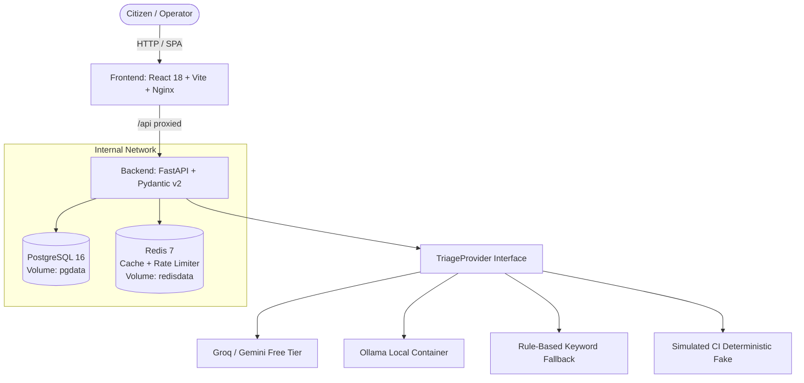

# CivicPulse — Municipal Complaint Intake, Triage & Operations Platform

[](https://github.com/MannanJaffery/civicpulse-platform/actions/workflows/ci.yml)
[](https://github.com/MannanJaffery/civicpulse-platform/actions/workflows/cd.yml)

CivicPulse is an end-to-end municipal complaint intake, AI-driven triage, and operations dashboard platform designed for high availability, fault tolerance, and automated operations.

---

## 1. System Architecture



---

## 2. One-Command Quickstart

```bash
# 1. Clone repository
git clone https://github.com/MannanJaffery/civicpulse-platform.git
cd civicpulse-platform

# 2. Configure environment
cp .env.example .env

# 3. Start stack with Docker Compose
docker compose up -d

# 4. View running services
# Frontend: http://localhost
# Backend API & Docs: http://localhost:8000/docs
# Health Probe: http://localhost:8000/health
# Readiness Probe: http://localhost:8000/ready
```

---

## 3. API Contract Table

| Method | Path | Behaviour |
| :--- | :--- | :--- |
| `POST` | `/api/complaints` | Validate → triage → persist. Returns `201`. Field errors return `400`. Rate-limit returns `429`. |
| `GET` | `/api/complaints/{id}` | Returns single complaint `200` or `404`. |
| `GET` | `/api/complaints` | Filter by category, priority, status; paginated (`page_size <= 100`). |
| `PATCH` | `/api/complaints/{id}/status` | Enforce explicit status state machine. Invalid transition returns `409`. |
| `GET` | `/api/stats` | Aggregates, Redis-cached with 30s TTL, `X-Cache: HIT/MISS`. |
| `GET` | `/api/meta/providers` | Active triage provider & last 20 triage outcomes for observability. |
| `GET` | `/health` | Liveness probe (process alive, does not touch database). |
| `GET` | `/ready` | Readiness probe (`200` if DB + Redis reachable, `503` if dependency down). |
| `GET` | `/metrics` | Prometheus metrics (request count, latency histogram, triage latency, fallback counter). |

---

## 4. Documentation Index

- [AI Usage Log](docs/AI-USAGE.md)
- [Engineering Notes & 8 Core Questions](docs/ENGINEERING-NOTES.md)
- [Operations Runbook](docs/RUNBOOK.md)
- [Triage Documentation](docs/TRIAGE.md)
- [ADR 0001: Provider Interface](docs/adr/0001-provider-interface.md)
- [ADR 0002: Frontend Runtime Configuration](docs/adr/0002-frontend-runtime-config.md)
- [ADR 0003: Immutable Deploy by SHA](docs/adr/0003-deploy-by-sha.md)
- [ADR 0004: PII and Data Governance](docs/adr/0004-pii-and-data-governance.md)
