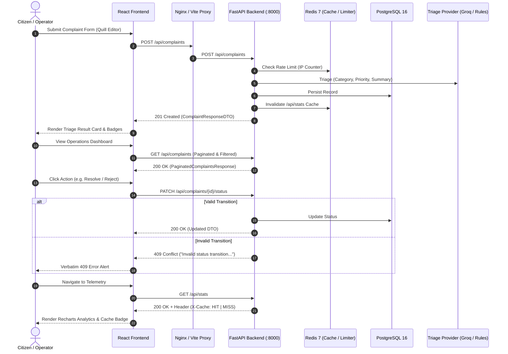

# Frontend-Backend API Integration Specification

This document provides a comprehensive overview of the integration between the **CivicPulse Frontend** (React 18 + Vite SPA) and the **FastAPI Backend**, detailing endpoint bindings, data models, error handling semantics, and caching behavior.

---

## 1. Architecture & Network Flow



---

## 2. API Endpoints Binding Matrix

| HTTP Method | Backend Path | Frontend API Client Function | Component / Page Usage | Description & Payload |
| :--- | :--- | :--- | :--- | :--- |
| `POST` | `/api/complaints` | `submitComplaint(payload)` | `src/pages/Submit.tsx` | Citizen incident intake. Accepts `{ text, location, reporter_contact }`. Returns `201` with AI classification & latency. |
| `GET` | `/api/complaints` | `getComplaints(filters)` | `src/pages/Dashboard.tsx` | Filterable and paginated complaint listing (`page`, `page_size`, `category`, `priority`, `status`). |
| `GET` | `/api/complaints/{id}` | `getComplaint(id)` | `src/components/ComplaintDetailModal.tsx` | Full complaint narrative and metadata inspection by UUID. |
| `PATCH` | `/api/complaints/{id}/status` | `updateStatus(id, newStatus)` | `src/pages/Dashboard.tsx`, `ComplaintDetailModal` | Lifecycle state transitions (`open` → `in_progress` → `resolved`/`rejected`). Enforces 409 conflict. |
| `GET` | `/api/stats` | `getStats()` | `src/pages/Dashboard.tsx`, `src/pages/Stats.tsx` | Aggregate metrics grouped by category, priority, and status. Inspects `X-Cache: HIT/MISS` response header. |
| `GET` | `/api/meta/providers` | `getMetaProviders()` | `src/pages/Stats.tsx` | Observability surface returning active triage provider name and last 20 triage execution outcomes. |
| `GET` | `/health` | `getHealth()` | `src/components/Navbar.tsx` | Process liveness probe (strictly isolated from database/cache). |
| `GET` | `/ready` | `getReady()` | `src/components/Navbar.tsx` | Infrastructure readiness probe verifying PostgreSQL & Redis connectivity. |
| `GET` | `/metrics` | N/A (Prometheus) | Prometheus Scraper | Prometheus text-format exposition for telemetry scraping. |

---

## 3. Data Transfer Objects (DTO) Contract

### `ComplaintResponseDTO`
```typescript
export interface Complaint {
  id: string;                      // Server-generated UUID
  text: string;                    // 10–2000 chars
  location: string;                // 3–200 chars
  reporter_contact?: string | null;// Nullable / confidential contact
  category: Category;              // water | electricity | sanitation | roads | streetlights | other
  priority: Priority;              // high | normal | low
  status: Status;                  // open | in_progress | resolved | rejected
  ai_summary?: string | null;      // One-line summary (<= 140 chars)
  triaged_by: string;              // llm:groq | llm:gemini | ollama | rules | rules:fallback
  triage_latency_ms: number;       // Execution duration in ms
  created_at: string;              // ISO UTC timestamp
  updated_at: string;              // ISO UTC timestamp
}
```

### `PaginatedComplaintsResponse`
```typescript
export interface PaginatedComplaintsResponse {
  items: Complaint[];
  total: number;
  page: number;
  page_size: number;
}
```

### `ProvidersMetaResponse`
```typescript
export interface ProvidersMetaResponse {
  active_provider: string;
  outcomes: Array<{
    provider: string;
    latency_ms: number;
    fallback: boolean;
    timestamp: string;
  }>;
}
```

---

## 4. State Machine & 409 Conflict Contract

The backend implements an explicit transition table without business rules leaking into the frontend:

```text
open ----------> in_progress ----------> resolved (terminal)
  |                  |
  +------------------+-----------------> rejected (terminal)
```

- **Valid Transitions**:
  - `open` → `in_progress`
  - `open` → `rejected`
  - `in_progress` → `resolved`
  - `in_progress` → `rejected`
- **Invalid Transitions**:
  - Triggering `resolved` → `open` or `rejected` → `in_progress` results in `409 Conflict` with detail message:
    `"Invalid status transition from '<current>' to '<target>'"`
  - The frontend surfaces this exact backend detail message verbatim without generic masking.

---

## 5. Cache Semantics & Observability

- **Read-Through Cache**: `/api/stats` is cached in Redis with a 30-second TTL.
- **Cache Invalidation on Write**: Submitting a new complaint (`POST /api/complaints`) immediately invalidates the `/api/stats` cache key in Redis, guaranteeing that dashboard metrics reflect newly registered incidents on the next request.
- **Header Inspection**: The API returns `X-Cache: HIT` or `X-Cache: MISS`. The frontend parses this response header to render the real-time cache badge in the navigation header and analytics page.

---

## 6. Runtime Configuration (Build-Once-Deploy-Many)

- **No Hardcoded Absolute URLs**: The frontend code makes requests exclusively to relative paths (`/api/*`, `/health`, `/ready`).
- **Nginx Reverse Proxy**: In containerized/production environments (`compose.yaml`, Kubernetes Ingress), Nginx reverse-proxies `/api/` to `http://backend:8000/api/`.
- **Vite Proxy**: In local development (`npm run dev`), `vite.config.ts` proxies `/api`, `/health`, and `/ready` to `http://localhost:8000`.
- The exact same compiled static frontend artifact can be deployed to development, staging, or production without rebuilding.
